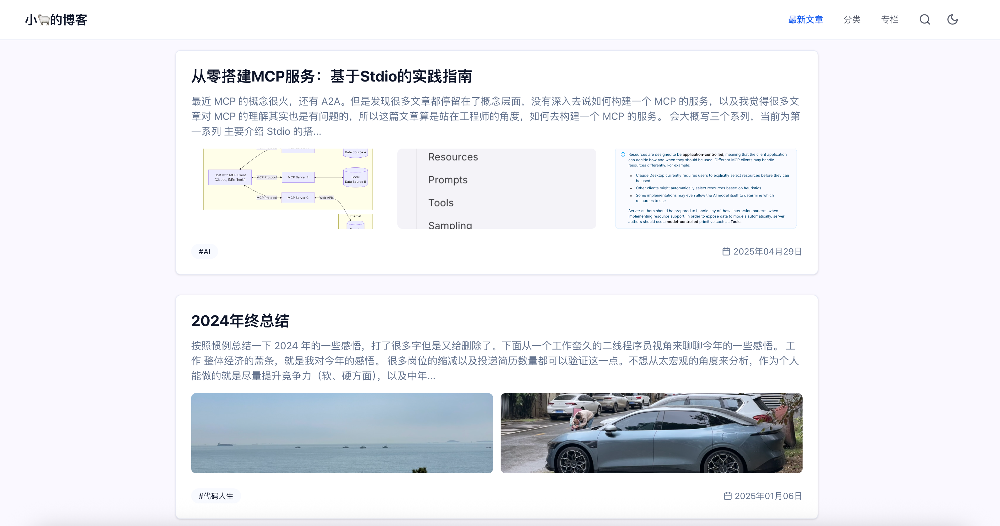

# My Blog

欢迎来到我的博客！👋 我是 yliu，主要从事前端开发和 AI 开发。欢迎交流想法！

🚀 [点击阅读](https://bosens-china.github.io/blog/page/1/)

> 博客基于 [yliu-blog-engine](https://github.com/bosens-China/yliu-blog-engine) 搭建，这是一个我开发的博客引擎。
> 通过简单的 CI 配置即可快速搭建博客，并支持使用 AI 增强 SEO 和站点功能。

## 协议

除非特别说明，文章内容均采用 [署名-非商业性使用-相同方式共享 4.0 国际许可协议（CC BY-NC-SA 4.0）](https://creativecommons.org/licenses/by-nc-sa/4.0/deed.zh) 进行许可。

转载或引用时，请注明作者及原文链接，并遵守协议条款。
