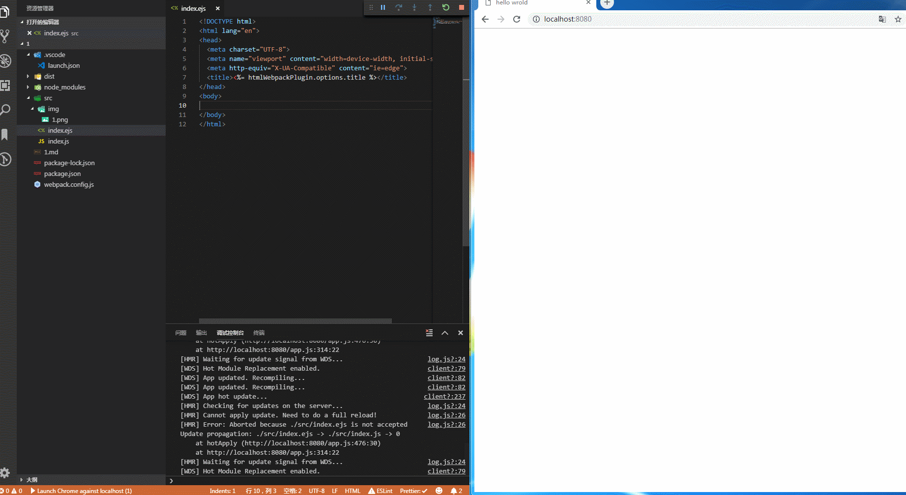

> At its core, webpack is a static module bundler for modern JavaScript applications. When webpack processes your application, it internally builds a dependency graph which maps every module your project needs and generates one or more bundles.

借用一下官方的定义， webpack 将所有模块递归成一个依赖关系图，如果想让 html 实现修改刷新必须在入口中引入这个 html 文件，从而监视到修改变化。

这里借用了一个 `raw-loader`，**在入口的 js 文件中导入文件** 

```js
import "./index.ejs";
```

这里说下为什么使用.ejs 文件的原因，因为 html-loader 与 raw-loader 冲突，采用了一个折中的方法

html-loader 可以处理\标签在 html 文件中无法被打包的问题；

关于 ejs 文件可以自行查询文档，这里简单把它当做 html 文件来使用，最后使用
`ejs-loader,html-loader,extract-loader 和 html-webpack-plugin` 把 ejs 文件转化为 html 文件

下面是主要代码

```js
const path = require("path");
const HtmlWebpackPlugin = require("html-webpack-plugin");
const webpack = require("webpack");

module.exports = {
  // ... 省略
  plugins: [
    new HtmlWebpackPlugin({
      title: "hello wrold",
      filename: "index.html",
      template: "./src/index.ejs"
    }),
  ],

  module: {
    rules: [
      {
        test: /\.ejs$/,
        use: [
          "extract-loader",
          {
            loader: "html-loader",
            options: {
              attrs: "img:src"
            }
          },
          "ejs-loader"
        ]
      },

    ]
  },
};
```
效果如下


可以点开webpack.config.js和src查看具体源码
当然上面import导入在生产环境下实际上是不需要的，可以使用import()来实现，注意，这个方案还在提案必须使用babel
``` js
if(process.env.NODE_ENV === 'development') {
  import('./index.ejs');
}
```

> 参考
>
> 1.  https://github.com/webpack-contrib/html-loader/issues/195
> 2.  https://github.com/AriaFallah/WebpackTutorial/tree/master/part1/html-reload
